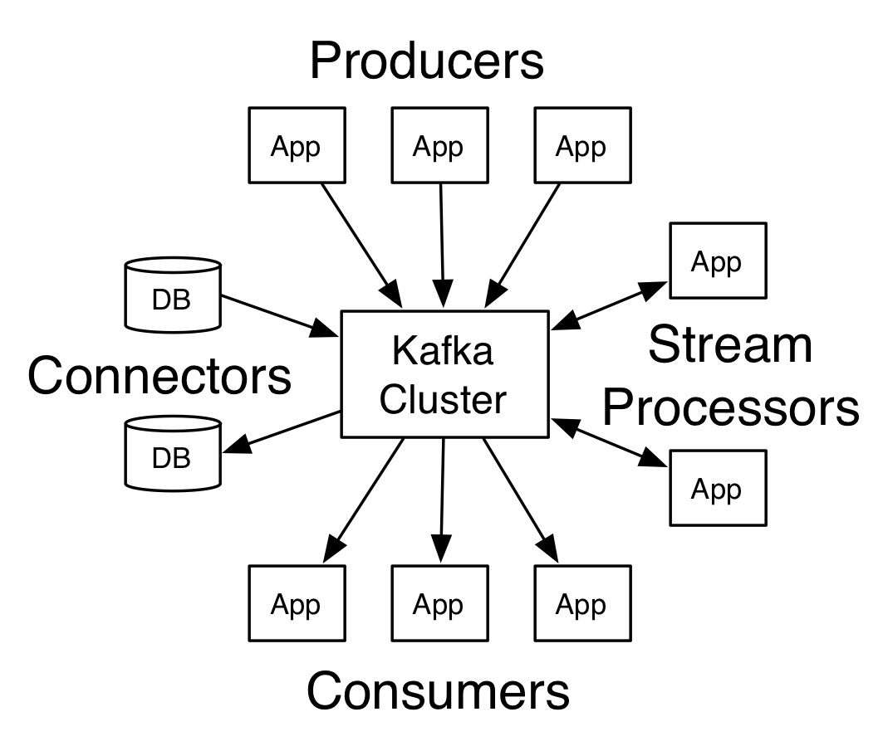
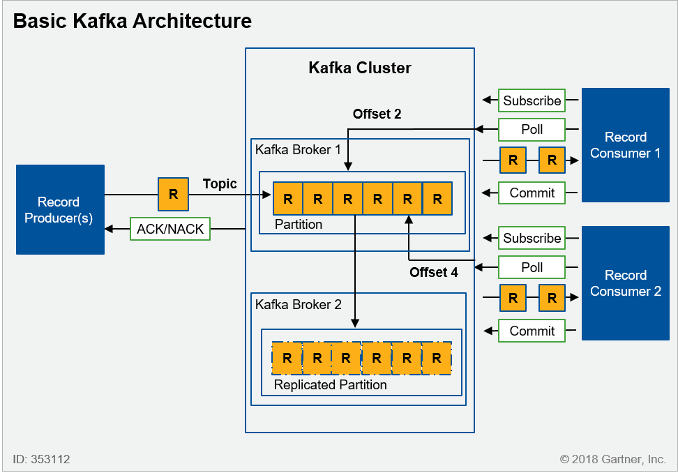
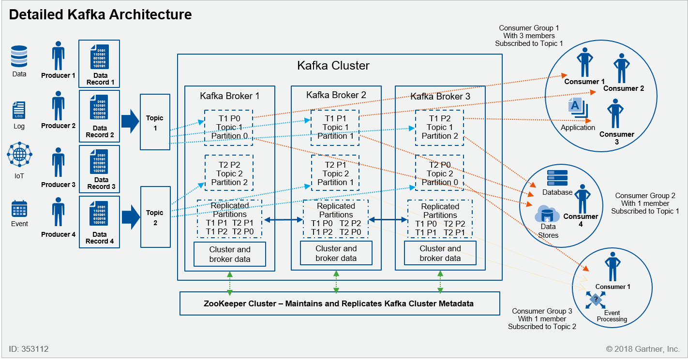

# O que é Apache Kafka

---
[Apache Kafka](https://kafka.apache.org/) é uma plataforma distribuída de streaming, criada pelo time do Linkedin e transformada em open-source, mantida pela Apache Foundation.

Horizontalmente escalável, tolerante a falhas e com grande velocidade, permite a ingestão, tratamento e publicação de enorme volume de dados em tempo real.

## O que é uma plataforma de Streaming?

Por plataforma de streaming, entendemos que a mesma deve ser capaz de:

- Permitir modelo Publisher-Subscriber de comunicação, similar aos sistemas de enfileiramento de mensagem, como RabbitMQ, Tibco EMS, Azure Message Bus, dentre outros.
- Armazenar de forma durável e tolerante a falhas os dados trafegados
- Processar os dados recebidos em tempo real

Sendo assim, podemos dizer que uma plataforma de streaming permite que vários sistemas e/ou aplicações consigam conversar entre sí de forma assíncrona e em tempo real, podendo ou não realizar transformações diretamente no broker (gerando novas mensagens) antes de entregar as mensagens ao destino final.

## Como o Kafka funciona?

Pela natureza de plataforma distribuída, um cluster Kafka é composto por N brokers, sendo que cada um destes atua como líder (Leader) de uma determinada partição, através de eleição pelo [Apache ZoeKeeper](https://zookeeper.apache.org/) e os demais como seguidores (Followers). 
Cabe ao líder ficar responsável pela escrita e leitura de dados da sua partição, e aos seguidores espelhá-las através de replicação dos eventos sinalizados pelo líder.

É possível trabalhar com apenas uma instância do Kafka, contudo perde-se as capacidades de redundância, resistência a falhas e escalabilidade.

Um cluster Kafka fornece basicamente 3 APIs:

- Producer API: Permite as aplicações publicarem (transmitirem) conteúdo
- Consumer API: Permite as aplicações assinarem/consumir tópicos e resultados de stream processors
- Stream Processors: permite que aplicações atuem como stream processors consumindo dados de um ou mais tópicos e tranformando-os em outros tópicos
- Connector API: permite criar e executar bibliotecas para publicação/assinatura integrada a componentes externos, como bancos de dados.

[Fonte: Apache Kafka]

### Componentes básicos do Kafka

- Record: Denominado como Message até a versão 0.8.2, um record é basicamente o dado gravado no Kafka. Apesar de não haver limite de tamanho, usualmente é menor que 1MB.
- Topic: Agrupamento de records enviados pelos Producers e que juntos fazem algum sentido e são assinados por Consumers
- Partition: Com objetivo de aumentar a escalabilidade através de paralelismo tanto de leitura quando escrita, o Kafka automaticamente divide um topic em partitions. Todos os brokers possuem uma replica de todas as partições, entretanto, há um mecanismo de eleição de líder para definir quem é o responsável por escrita na partição específica.
- Cluster: Coleção de brokers kafka
- Producer: Apps geradoras de records, a serem publicados em topics
- Consumer: Apps assinantes de tópicos
- Offset: Posição de leitura em um topic.
- Consumer Group: Isolamento lógico para leitura, muito utilizado em cenários de leitura com paralelismo, onde o consumer group compartilha o mesmo offset.

Veja na imagem abaixo o funcionamento de gravação em um topic, através de balanceamento de partições. O controle na leitura é feito através de um log no broker.

[Fonte: Apache Kafka]

Cada consumer group possui um offset e apps no mesmo consumer group concorrem entre si.

[Fonte: Apache Kafka]

Dentre as principais características do Kafka, posso destacar que os dados são armazenados de forma imutável e persistente, ou seja, registros uma vez recebidos, nunca sofrerão alteração* e são retidos por tempo configurável (TTL), que por padrão é de 7 dias.

***Caso hajam transformações no kafka Streams, são gerados novos records a serem inseridos em outro topic.**

Por trabalhar com o padrão publish-subscribe (pub-sub), é bastante utilizado em cenários de arquiteturas orientadas a eventos (event-driven), permitindo a criação de sistemas desacoplados, que notificam eventos sem precisar saber da existência dos seus consumidores.

### Arquitetura básica do Kafka

[Fonte: Gartner]

[Fonte: Gartner]
