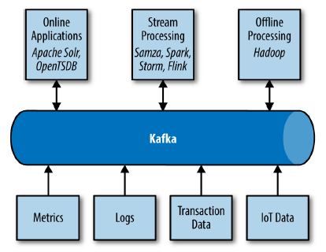
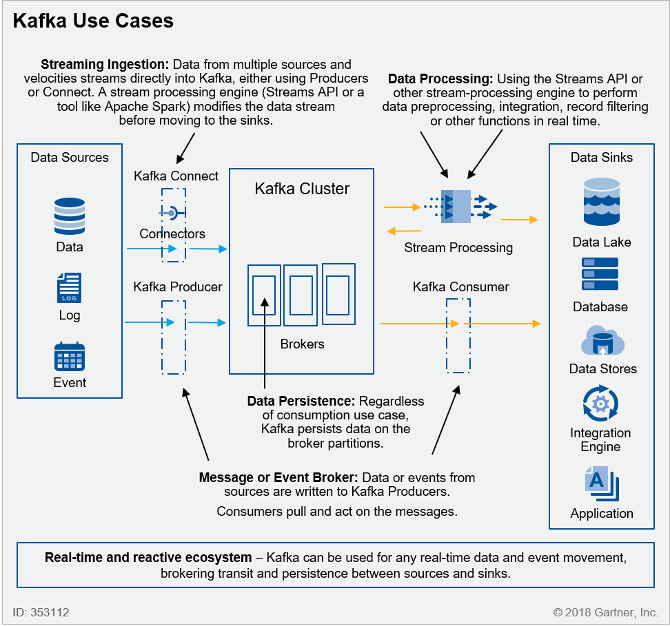

# Cenários de uso

---

Existem vários cenários onde o Apache Kafka pode ser útil. Por ter sido projetado para processamentos em tempo real, recebe, armazena e entrega dados com baixa latência e alta vazão. Por isso, pode ser usado tanto em cenários básicos de troca de mensagens assíncronas, como em canários mais complexos de sincronia de dados entre bases.

[Fonte: [Kafka: The Definitive Guide](https://www.confluent.io/resources/kafka-the-definitive-guide/)]

## Mensageria

O cenário mais básico de uso do Kafka é utilizá-lo como um substituto de um message broker tradicional, como RabbitMQ, TIBCO EMS, dentre outros. Dentre as vantagens, podemos citar que o Kafka possui melhor throughput que os brokers tradicionais, já vem com  mecanismos de particionamento, replicação e tolerância a falhas.

Brokers de mensageria tradicionais trabalham com Filas (Queues) e Tópicos (Topics). Já no Kafka temos apenas a estrutura de tópicos, onde vários consumidores podem consumir os dados destes. Além disso, não há o conceito de "tirar" uma mensagem da fila. Cada cliente é responsável pelo posicionamento (offset) de leitura, mantendo as mensagens persistentes por tempo tão distante quanto configurado.

## Activity Tracking

Monitoramento de atividade do usuário foi o objetivo motivador para a criação do Kafka, quando desenhado pelo time do LinkedIn.
Monitorar o comportamento de uso de uma determinada aplicação pode ser útil para entender comportamento, intenções e dificuldades que um usuário pode ter ao utilizar um produto. Além disso, estas informações podem ter grande valor para realização de Testes A/B.
O volume de informações pode ser gigantesco, e precisa ser muitas vezes entregues em pipelines de Machine Learning, geração de relatórios, atualização de resultados de pesquisa ou mesmo atividades para enriquecer a experiência do usuário. Os dados podem ser injetados diretamente em tópicos do Kafka, processados através de Stream Processors e entregues nos devidos backends que cuidarão das análises.

## Metrics & Logging

Múltiplas aplicações podem gerar um volume enorme de dados de logs, metricas e dados de tracing. Estes dados podem ser consumidos por sistemas de monitoramento e alertas em tempo real, ou mesmo processados de forma offline por sistemas como o [Hadoop](https://hadoop.apache.org/) e serem enviados para indexação em sistemas como o [Elasticsearch](https://www.elastic.co/products/elasticsearch).
Utilizar uma middleware como o Kafka nestes cenários é util pois se for alterada algumas das partes de origem/destino dos dados, não há impacto no restante da solução.

## Event Driven Architectures

Aplicações modernas são desenhadas visando baixo acoplamento e possibilidade de escalar horizontalmente. Sendo assim, uma aplicação pode ser composta de pequenos produtos com responsabilidades bem delimitadas, e para isso acabam necessitando realizar muita comunicação entre si. Diferente de arquiteturas tradicionais, onde sistemas chamam uns aos outros, muitas vezes criando vínculos fortes entre si, uma aplicação moderna vale-se mais de comunicar fatos ocorridos no seu domínio, deixando que as diversas aplicações que de alguma forma tenham algum interesse neste domínio, observem os acontecimentos para tomarem ações baseadas neles. Eventos são imutáveis e não requerem respostas de quem os consome.

De forma prática, um evento ocorrido em um determinado sistema pode desencadear ações em outros sistemas interessados, que assinam seus eventos (pub-sub). O desacoplamento é alcançado pois o sistema gerador não tem conhecimento de quem está consumindo seus eventos.

Uma outra vantagem, é que numa arquitetura event-driven, diferente de uma abordagem REST/RPC, não existe necessidade de que todos os serviços estejam online no momento da execução do caso de uso, tornando assim a solução mais robusta como um todo.

## Sincronização de dados (microsserviços autônomos, event sourcing, CQRS e ETL)

Quando utilizamos uma MSA (Micro-Services Architecture), lidamos com serviços desacoplados até o nível do banco de dados, ou seja, tanto schema quanto dados estão segregados e são de responsabilidade única do microsserviço.

Apesar do benefício do isolamento, acabamos com um problema nos consumidores, que para buscarem informações que não são do seu domínio, precisam realizar requisições REST/RPC, implicando em latência.
Uma saída para esta característica é manter uma réplica dos dados, ou cache, e preocupar-se apenas com as atualizações, observe que neste caso lidamos com consistência eventual, ou seja, os dados mantidos em réplica, podem estar desatualizados em relação à fonte proprietária.

Kafka pode ser utilizado para geração de eventos de atualização de dados. Os microsserviços que mantêm replicas de bases assinam tópicos de eventos de atualização de dados, e assim recebem todas as alterações sem precisar consultar os serviços donos.

Esta abordagem é útil tanto em microsserviços autônomos quanto em abordagens event sourcing e CQRS, onde é preciso observar as atualizações que acontecem nos dados.

Além dos cenários acima, é possível também utilizar o Kafka para cenários de ETL (Extract, Transform, Load), seja para ingestão de dados e entrega em outro tópico ou sink (conector para outros destinos, como um AWS S3, ElasticSearch, ou mesmo um banco de dados), quanto para ingestão e transformação, enriquecendo e/ou compondo os dados antes de serem entregues em outro destino.
Para estes casos, pode-se tanto gerar os eventos diretamente no tópico, quanto utilizar conectores para ingestão. Além disso, uma vez no broker, é possível utilizar stream processors (ex. Apacha Spark) para alterar os dados e publicá-los em outro destino.

[Fonte: Gartner]

**Mais informações:**

[Usos do Kafka](https://kafka.apache.org/uses)

[Kafka Streams Documentation](https://kafka.apache.org/documentation/streams/)

[Event Driven](https://martinfowler.com/articles/201701-event-driven.html)

[Best Practices for Event-Driven Microservice Architecture](https://hackernoon.com/best-practices-for-event-driven-microservice-architecture-e034p21lk)

[CQRS](https://martinfowler.com/bliki/CQRS.html)

[Event Sourcing](https://martinfowler.com/eaaDev/EventSourcing.html)
