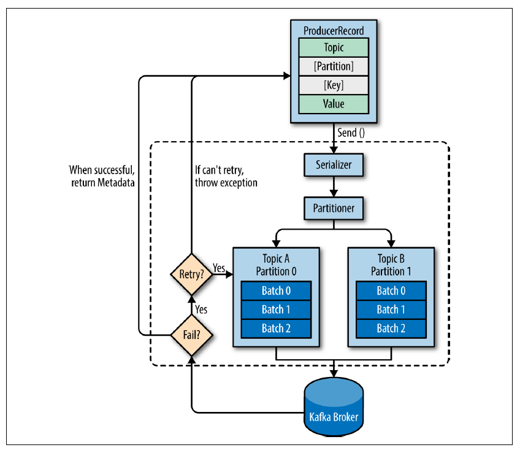

# Producers Avançado

---

A API para produção de registros é bem simples, entretanto é interessante conhecê-la mais profundamente de forma a tirar o melhor do produto.

Veja no desenho mais abaixo o funcionamento geral da Producer API.

Fonte: [Kafka: The Definitive Guide](https://www.confluent.io/resources/kafka-the-definitive-guide/)

O processo inicia-se no cliente, criando um ProducerRecord, que obrigatóriamente deve ter configurado qual o tópico e deverá também ter um valor. Pode-se opcionalmente especificar qual a chave e/ou partição da mensagem.

Os dados são então serializados em ByteArrays para serem trafegados através da rede e enviados ao partitioner. Caso tenhamos especificado a partição, o partitioner apenas a devolve, caso contrário o partitioner definirá a partição destino, geralmente baseada na chave do Registro.

Definida a partição, o registro irá para uma fila (buffer) junto a outros registros que estão prontos para serem gravados no mesmo tópico. Uma thread irá cuidar de enviar os registros dessa fila para os brokers Kafka.

Quando o broker recebe o registro, ele envia ao remetente uma resposta (RecordMetadata) com as informações do tópico, partição e offset do registro em caso de sucesso. Em caso de erro, o producer receberá o erro e poderá tentar o reenvio por algumas vezes antes de desistir e entregar o erro ao cliente.

## Formas de envio

Apesar de a biblioteca da Confluent para .Net permitir apenas envio assíncrono, existem 3 formas de se enviar mensagens no Kafka:

- Assíncrono
Dispara-se uma mensagem para o Kafka e aguarda o callback.

- Síncrono
Dispara-se uma mensagem para o Kafka e interrompe o processamento da thread até que o retorno seja recebido.

- Fire-and-forget
A mensagem é enviado ao broker e não nos importamos se chegará com sucesso ou não. Pela alta disponibilidade do Kafka e mecanismos de retry, é bem possível que a mensagem chegará com sucesso, entretanto, é possível sim ocorrer perda de mensagens. Mais abaixo veremos os tipos de erro mais comuns.
Uma chamada fire and forget é realizada por um producer configurado para não receber relatório de entrega (ProducerConfig.Acks = Acks.None)

## Tipos de erro

O Kafka tem um mecanismo automático de retry, que funciona basicamente no dois casos listados mais abaixo. Erros como "message size too large" nunca terão re-tentativas.

Os dois tipos de erros passíveis de re-tentativa no Kafka são os seguintes:

- Retriable errors:
Erros onde pode-se resolver tentando enviar novamente a mensagem, como perda de conexão com o broker.
- No leader error:
Erros onde há perda de consistência em uma partição e o cluster precisa eleger um novo líder. O Kafka por padrão (parâmetro MessageSendMaxRetries) tenta novamente outras vezes até que um novo líder seja eleito. Caso o número de tentativas seja excedido, aí sim será gerada uma exceção no producer.

## Parâmetros do Producer

Na [documentação do Apache Kafka](http://kafka.apache.org/documentation.html#producerconfigs) é possível consultar a lista completa de parâmetros do produto, entretanto, existem contextos onde alguns ajustes podem influenciar aspectos como latência, consumo de memória, dentre outros. Veja abaixo alguns que podem ser úteis.

### acks

Um registro é considerado consistente quando gravado em todas as réplicas de partições. O parâmetro Acks serve para configurar quantas confirmações serão enviadas ao producer, podendo ser uma das seguintes:

- Acks = 0
  O producer não aguardará confirmação do broker, aumentando bastante sua capacidade de throughput, todavia, caso o broker não tenha recebido sua mensagem a mesma será perdida.
- Acks = 1
  O producer receberá a confirmação de sucesso no momento que a réplica líder receber a mensagem. Caso a réplica líder falhe, um erro será recebido pelo Producer, que tentará enviar novamente. Neste cenário, caso o líder trave e seja necessário escolher um novo líder, pode haver perda de mensagem caso o líder eleito não a tenha (o que é chamado de unclean leader election). 
  Ainda para esta configuração, o throughput pode ser afetado caso esteja usando chamadas síncronas ou se o parâmetro de máximo de mensagens in-flight (MaxInFlight) seja igual a 1. Lembrando que este parâmetro ajuda a manter a ordem das mensagens em casos de retry.
- Acks = all
  O retorno de sucesso será recebido apenas quando todas as réplicas receberem a mensagem. Esta é a confuguração de menor throughput entretanto é a que garante a maior segurança.
  
### buffer.memory

Caso você tenha algum cenário onde o throughput gerado pela aplicação é maior que a capacidade de envio para o broker, pode acabar a memória disponível para uso no broker.
Como visto antes, um producer enche um buffer de records a serem enviados ao broker. Esgotando este espaço e estando bloqueada/travada a thread de envio, pode haver exceção. O producer bloqueará a produção de mensagens por tempo determinado no parâmetro max.block.ms.

### compression.type

Por padrão o Kafka vem com a compactação desabilitada. Comprimir mensagens resulta em menor uso de rede e armazenamento em disco, geralmente gargalos.

O Kafka oferece 4 mecanismos de compressão, que são:

- gzip: Algorítmo que entrega ótima capacidade de compressão, contudo utiliza mais CPU e tempo.
- snappy: Algorítmo criado pela Google, que garante boa taxa de compressão e baixo impacto em CPU. É recomendado em cenários onde largura de banda e desempenho são críticos.
- lz4: Taxa de compactação próxima a do snappy, entretando possui maior velocidade para descompactação.
- zstd: Algorítmo de compressão criado pela Facebook, similar ao snappy. Alguns testes mostram considerável vantagem neste.

A recomendação de uso pode variar conforme combinação de hardware, codecs e casos de uso. Cada empresa deve realizar seu próprio benchmark.

Vale observar que quanto maior o buffer para batching, maior será o aproveitamento da compressão.

### retries

Como dito anteriormente, o producer já lida com novas tentativas de envio em caso de erros transientes, como eleição de novo líder, sendo assim não é preciso tratar lógicas de retry na aplicação. O esforço deve ser empregado em tratar erros não transientes.

O ponto a se analisar nesta configuração é encontrar qual o melhor parâmetro de tempo de espera entre as tentativas, por padrão o parâmetro retry.backoff.ms vem configurado em 100 ms. A recomendação é analisar quanto tempo seu cluster leva para eleger um novo líder, voltar de uma situação de crash, dentre outros, e definir a quantidade de retentativas e o intervalo entre elas, para evitar estourar os limites e receber uma exceção do producer.

### batch.size

O producer acumula mensagens antes do envio. Se definido como 0 bytes, nenhum batch será criado, e as mensagens são enviadas de imediato, ocasionando em queda de throughput. Se definido o valor máximo, muita memória será alocada antecipadamente para acumular o buffer.

### linger.ms

Este parametro indica quanto tempo o producer aguardará para receber uma nova mensagem a ser colocada no buffer antes de enviar. Pode ser útil caso necessário diminuir a quantidade de requests ao broker. Aumentar a quantidade de mensagens enviadas por vez significa aumentar o throughput, no entanto, aumenta-se também a latência.
Por padrão vem definido como 0, ou seja, assim que o producer tenha uma thread de envio disponível, ele envia a mesma ao broker.

### max.in.flight.requests.per.connection

Limita a quantidade de requisições de envio sem confirmação por conexão, ou seja, se uma mensagem não receber ack, o producer será bloqueado até que a retentativa obtenha sucesso.
Isso garante ordenação das mensagens (FIFO), entretanto diminui o throughput. Por padrão vem configurado como 5.

### client.id

Informação livre para identificar no servidor a origem das mensagens, além de apenas o IP do mesmo. Importante para cenários de tracing.

### idempotence

Habilitando este parâmetro temos a garantia de que exatamente uma cópia da mensagem foi escrita no tópico, evitando a duplicação em casos de retry. Garante-se também ordenação.
Quando habilitado, automaticamente trabalhamos com os parametros max.in.flight.requests.per.connection = 5, retries=INT32_MAX e acks=all

Referências: 

[Apache Kafka Documentation](http://kafka.apache.org/documentation.html#producerconfigs)

[Kafka: The Definitive Guide](https://www.confluent.io/resources/kafka-the-definitive-guide/)
