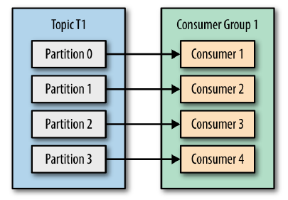
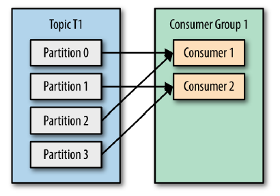
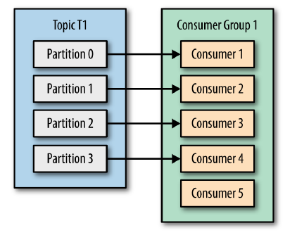

# Consumer Avançado

---
O Apache Kafka é um sistema que compartilha uma característica comum a muitos sistemas de mensageria que é ser um sistema puxado e não empurrado, ou seja, quem dita o ritmo da vazão é o Consumer.
Consumer é um client que lê mensagens em um tópico. Consumer Group é uma forma de escalar o throughput do Kafka, paralelizando consumidores de forma agrupada, na leitura de um tópico.

Aumentar o throughput significa aumentar a quantidade de partições e de consumers. Se o número de partições for igual ao número de consumers no grupo, cada um ficará responsável por tirar mensagens de uma partição.

[Fonte: Kafka: The Definitive Guide]

Se o número de partições for menor que o número de consumers no grupo, o broker escalonará o envio de mensagens de forma igual para cada consumer.

[Fonte: Kafka: The Definitive Guide]

Já se um número de partições for menor que o número de consumers no grupo, os consumers excedentes ficarão ociosos.

[Fonte: Kafka: The Definitive Guide]

O broker possui um coordenador que sempre rebalanceará o mapeamento quando houver entrada ou saida de consumers de um determinado consumer group.

Caso um consumer fique ocioso por muito tempo, ele é marcado como dead e o rebalanceamento ocorre.

## Semânticas de entrega de mensagem

Um dos problemas mais conhecidos e de difícil solução no mundo de sistemas distribuídos, está relacionado à semântica de entrega de mensagens.
Pela natureza distribuída, podem ocorrer falhas em vários pontos da solução, e começamos a enfrentar cenários como perda de mensagem, processamentos em duplicidade ou em ordem errada.
Imagine um cenário onde é iniciada uma transação de saque em uma conta corrente. Se a mensagem não chegar, corre-se o risco de entregar o dinheiro sem debitar o valor do saque; se a mensagem chegar duas vezes, corre-se o risco de debitar em dobro; se a mensagem chegar em ordem inversa, pode não haver saldo na solicitação de saque, impedindo-o.

As semânticas são as seguintes:

## At least once (Pelo menos uma vez)

No cenário perfeito o producer envia uma mensagem ao broker, que recebe com sucesso (acks=all). A mensgagem foi entregue apenas uma vez.
Na prática, pode ocorrer um erro no broker, ou o producer tomar timeout. O producer reenviará a mensagem, tudo certo caso ela não tenha sido gravado no log, todavia se o broker tiver previamente gravado mas teve problema no envio do ack, teremos então uma mensagem duplicada.

Do ponto de vista do consumer, ele retira a mensagem do tópico, processa a mensagem e só então realiza o commit no offset. Caso o consumer trave durante o processamento da mensagem, ao reiniciar ele retirará novamente a mesma mensagem do tópico, e somente ao concluir com sucesso realizará o commit no offset. Não há perda de mensagem, mas pode haver duplicação.

Configurações do cliente para garantir esta semântica:
acks=all, max.in.flight.requests.per.connection=1, retries > 0

## At most once (No máximo uma vez)

Ainda no cenário de exemplo do saque, se o Producer tiver enviado uma mensagem, e não recebeu o ack, para evitar duplicação não haverá retentativa de envio. Contudo, pode-se haver perda de mensagem.

Do ponto de vista do consumer, ele retira a mensagem do tópico, realiza commit do offset e então processa a mensagem. Caso o consumer trave entre o commit do offset e o processamento da mensagem, ao reiniciar começará do próximo registro sem ter obtido sucesso na mensagem anterior, ou seja, houve perda de mensagem.

Configurações do cliente para garantir esta semântica:
acks=1, max.in.flight.requests.per.connection=5

## Exactly once (Exatamente uma vez)

Ainda no cenário hipotético acima, mesmo havendo reenvio a mensagem será recebida apenas uma vez.
Este é o cenário mais desejado, e também o mais caro, pois envolve uma cooperação entre o broker e a aplicação cliente. Se o cliente não reconhecer uma mensagem como duplicada e processá-la, haverá duplicação. Lembre-se que pela natureza do Kafka, é possível voltar o offset do tópico realizando replay das mensagens. Se não ouver uma mecânica para garantir Exactly once no cliente, perde-se a garantia de unicidade.

Do ponto de vista do consumer, deve haver um processo transacional tanto no consumer quanto na aplicação que processa a mensagem, para em caso de erro, não realizar o commit no offset.

A partir da versão 0.11 do Kafka foi disponibilizado o conceito de idempotência, ou seja, a garantia de que uma mensagem seja entregue uma e apenas uma vez em uma partição específica de um tópico durante o tempo de vida de um producer. Além disso foi entregue também controle transacional (*até o fechamento deste artigo, não está disponível para o client .net*), permitindo atomicidade na entrega de um grupo de mensagens a mais de uma partição, ou seja, todas as mensagens são entregues ou nenhuma delas será. 

Juntos, estes dois recursos permitem alcançarmos a semântica Exactly Once. De acordo com o time da Confluent, pouco overhead é adicionado ao se habilitar estes recursos (3% de degradação comparado a configuração que garanta "at least once" e 20% comparado a configuração que garanta "at most once")

Funciona da seguinte forma, o producer recebe um Id e envia junto às mensagens um sequencial, que permite ao broker deduplicar as mensagens recebidas.

Configurações do cliente para garantir esta semântica:
Definir o parâmetro enable.idempotence = true na configuração de cliente do Producer.

Esta configuração basicamente limita os requests in-flight para o máximo de 5, retries > 0 e acks=all. Se algum destes parâmetros for configurado fora dessa regra, ocorrerá exceção no producer.

Vale lembrar o ponto citado anteriormente, se a aplicação consumidora não tiver os devidos cuidados para não processar mais de uma vez, sozinho o broker não entregará Exactly Once.

## Formas de consumo de tópicos

- Subscribe
Quanto utilizamos subscribe, o broker dinamicamente decidirá o balanceamento através do consumer group, indicando qual consumer lerá qual ou quais partições do tópico.

- Assignment
Caso haja algum cenário onde o consumer precise receber especificamente mensagens apenas de uma ou várias partições, é possível assinar o tópico especificando-as. Neste caso não há consumer group e a estratégia fica toda por conta do consumer.

- Seek
Existem casos de uso onde precisa-se movimentar pelo log. Nestes casos é possível utilizar o método Seek() para posicionar o offset no local desejado.
Um exemplo seria no caso de um sistema que se importe apenas com as informações mais recentes, então busca apenas os registros mais novos. Outro exemplo seria na tratativa de um bug, com necessidade de replay do log (event sourcing), posicionando o offset no local desejado e refazendo os passos perdidos.

Caso você tenha um cenário onde você mesmo controla o offset, é preciso definir o parametro enable.auto.commit=false.

## Boas práticas

- Unsubscribe e Close
Trabalhando com consumer groups, caso um consumer finalize seu trabalho e for deixar o grupo, otimizamos o uso do broker ao sinalizar a saída através dos métodos Unsubscribe e Close.
O broker gasta recursos ao manter estado de cada um dos consumers. Ao utilizar o método Close(), acontece o commit do offset do consumer, a saída deste do consumer group, rebalanceamento das partições entre os consumers restantes e a liberação de recursos do broker. Além disso, o consumer se desconecta do broker.
O método unsubscribe também força o rebalanceamento no coordenador do grupo, entretanto mantém a conexão ativa com o broker.

Referências:

[Apache Kafka Documentation](https://kafka.apache.org/documentation/#semantics)

[Kafka: The Definitive Guide](https://www.confluent.io/resources/kafka-the-definitive-guide/)

[Confluent Blog - Semantics](https://www.confluent.io/blog/exactly-once-semantics-are-possible-heres-how-apache-kafka-does-it/)

[DZone - Kafka Semantics](https://dzone.com/articles/kafka-clients-at-most-once-at-least-once-exactly-o)
