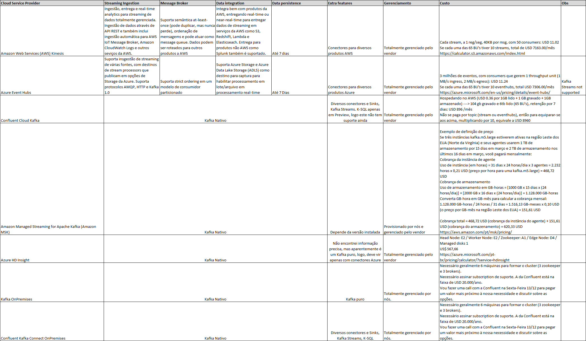

# Matriz de decisão

---

O estudo começou com a análise tanto do Apache Kafka em uma instalação On-premises, quanto produtos gerenciados por um provedor Cloud como o Confluent kafka, Amazon MSK e também produtos similares, que compartilham os conceitos do Kafka.

Confluent Kafka foi o vencedor, por ser um Kafka com poderes extras (Confluent Console, Schema Registry e Kafka Connect com base mais ampla de conectores), totalmente gerenciado, auto-escalável e por permitir multi-cloud / hybrid cloud.

Demais alternativas:

- Amazon Kinesis funciona analogamente ao Kafka, pois suporta processamento de fluxo de eventos, mas integra-se apenas aos produtos da AWS, além disso, não é possível consumir os streams diretamente de consumers do Kafka.
- Azure Event Hubs: Similar ao Kinesis, oferecendo boa integração com demais produtos da Azure. Tem como ponto favorável exportar a API do Kafka, permitindo que Kafka Consumers funcionem normalmente.
- Amazon MSK: Kafka Vanilla, provisionado pelo console da AWS e possui cluster gerenciado pela AWS. Entretanto todo o resto é de responsabilidade do usuário. Não é auto-escalável e atualizações são de responsabilidade do cliente.
- Azure HDInsight: Plataforma que oferece embutido Hadoop, Spark e Kafka. Pouco estudo foi realizado, por ter um escopo maior.
- Confluent Kafka On-Premises: Plataforma Kafka + recursos da Confluent (Connect, KSQL, Streams, etc). Open-source com subscription de suporte cobrada por quantidade de nodes. Um sizing com 3 brokers é suficiente para processar de 4 a 5 trilhões de registros por dia.

## Matriz inicial

## Finalistas

